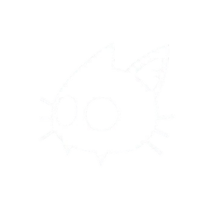

<h1 align="center">HII !! 🐱‍👤</h1>

 

###

- I do CSE or maybe CSE doing me 💀🌸  - I speak in : JAVA ☕ / PYTHON 🐍   - Expert in went to the basement and get shit done .  - Fun thing about me : i exists ( *it's concerning )

###

  

 
  

  
  

###

THINGS I KNOW  :

###

  
  
  
  
  
  
  
  
  
  
  
  
  
  
  
  
  
  
  
  
  
  
  
  
  
  
  

###

###

###

